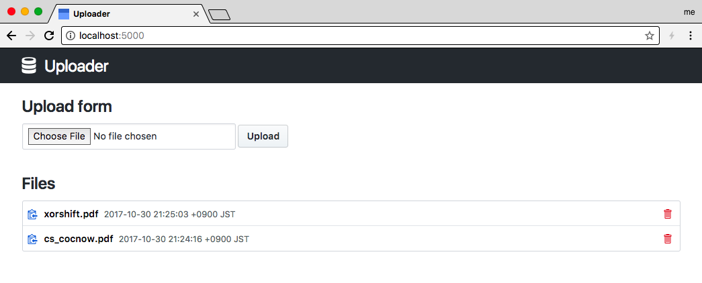

# Uploader

A simple file uploader with golang.



## build

```
glide install
go build
```

## Usage

```
./uploader
```

Uploader listens `:5000` and stores uploaded files in `./data` by default. If you want to change, see `./uploader --help`.

## License

[MIT License](LICENSE)

## Author

SAKATA Sinji ([sakasin.net](https://sakasin.net))
